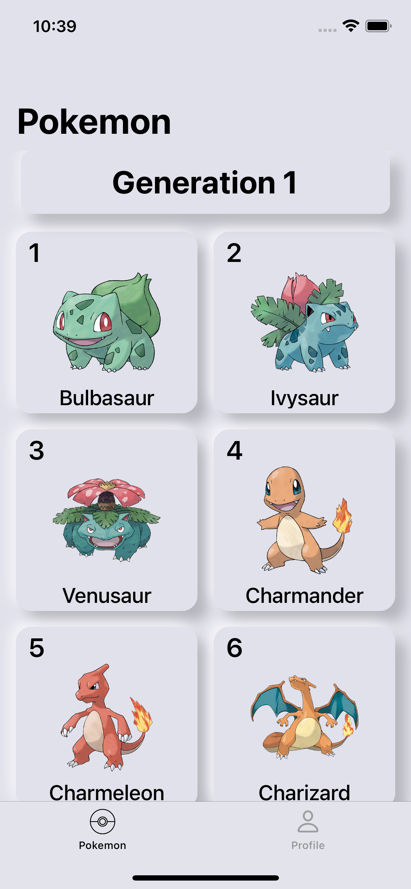
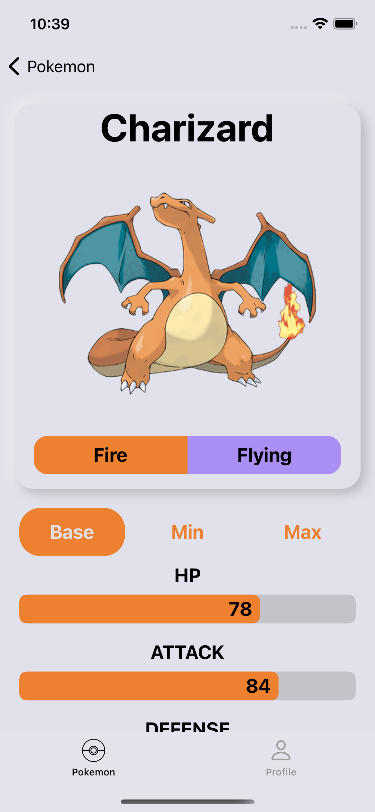
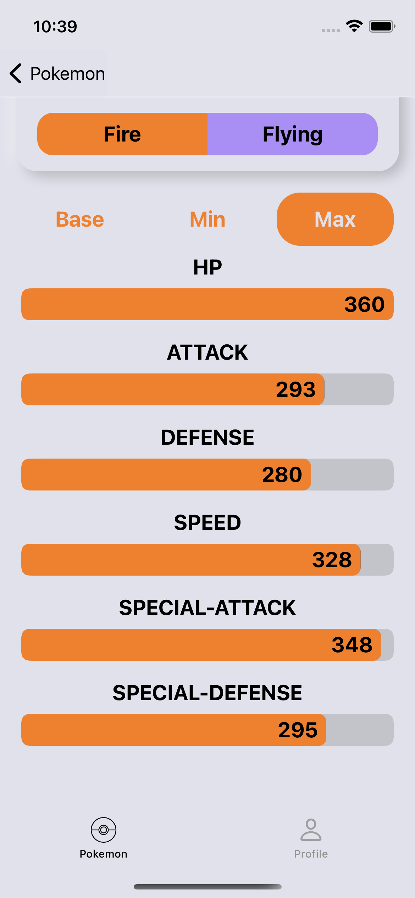
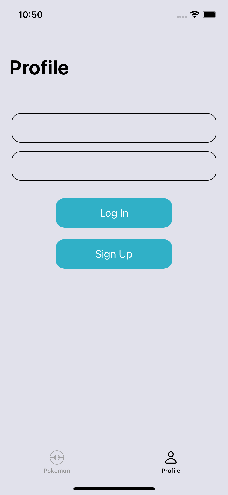

# Pokedex - SEI Project

## Description

This App is a project for the SEI lecture. The App is a small pokedex. It shows the pokemon in order and can also show some of the details. The project doesn't show all details of a pokemon because it needs more time.

## Screenshots

<!--  -->

<!--  -->

<!--  -->

<!--  -->

## Problems

### Userpage/Profilepage

-   clicking on a textfield removes the window
-   textfield doesn't show placeholder
-   compile errors when trying to add google sign in sdk

## Tasks

### Pokmonlistpage

-   [x] show pokemon by generation
-   [x] show pokemon detailspage on click

### Pokmondetailspage

-   [x] show pokemonimage/-type/-name
-   [x] show base/max/min stats
-   [ ] show weight,height,etc..
-   [ ] show evolutionchain and trigger
-   [ ] show forms if available
-   [ ] show species info
-   [ ] show abilities
